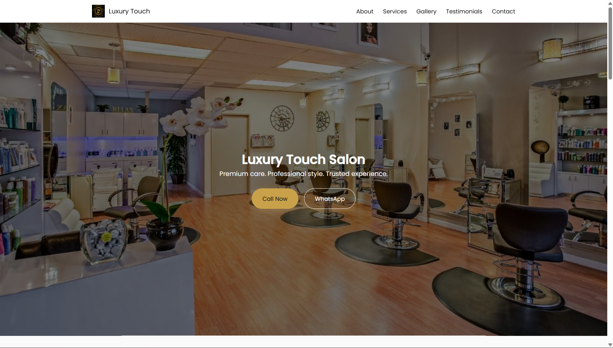

# Salon Website

A modern, responsive salon website built with HTML, CSS, and JavaScript, designed to showcase services, client testimonials, and contact details in a stylish and professional way.

---

## 🔗 Live Demo

[https://aryan-sengar-portfolio-v2.netlify.app/](https://salon-website.netlify.app/)

---

## 🚀 Features

- Responsive Design – Works seamlessly across desktop and mobile devices.
- Elegant Navigation – Smooth scrolling with a clean header and menu.
- Hero Section – Catchy tagline with quick call-to-action buttons (Call & WhatsApp).
- About Section – Highlights salon stats (experience, clients, stylists, ratings).
- Services Grid – Icons and cards for haircut, styling, facial, manicure, spa, and bridal services.
- Gallery Slider – Interactive image carousel powered by Swiper.js.
- Testimonials – Client reviews displayed in a slider format.
- Contact Section – Address, working hours, call/WhatsApp buttons, and embedded Google Map.
- Animations – Smooth fade-up effects and transitions using GSAP.
- Custom Branding – Logo, fonts, and icons for a premium look.

---

## 📁 Project Structure

---

salon-website/
│── index.html # Main HTML file
│── style.css # Stylesheet
│── script.js # JavaScript functionality
│── images/ # Logo, gallery, and testimonial images
│── README.md # Project documentation

---

---

## 🛠️ Tech Stack

- HTML5 – Semantic structure
- CSS3 – Styling & layout (style.css)
- JavaScript (ES6) – Interactivity (script.js)
- GSAP – Animations
- Swiper.js – Gallery & testimonial sliders
- Font Awesome – Icons
- Google Fonts – Playfair Display & Poppins

---

## 🚀 Getting Started

Clone the repository:

---

## git clone https://github.com/aryansengar007/salon-website.git

Navigate into the project folder:

---

## cd salon-website

Open index.html in your browser to view the site.

---

## 📸 Preview

- Hero Section: Premium care tagline with CTA buttons
- Gallery: Showcase of salon work
- Testimonials: Client feedback in slider format

---

## 👨‍💻 Author

Aryan Sengar
Frontend Developer | UI Enthusiast

---

## 🙌 Acknowledgements

I would like to acknowledge the open-source community for providing powerful tools that helped streamline the design and development process. Inspiration for UI/UX patterns was drawn from modern salon and luxury brand websites. This project was developed independently as a learning and portfolio initiative.

---

© 2025 Aryan Sengar – All Rights Reserved
Unauthorized copying is strictly prohibited.

---

> 💬 _Feel free to drop a ⭐ if you find this helpful!_
